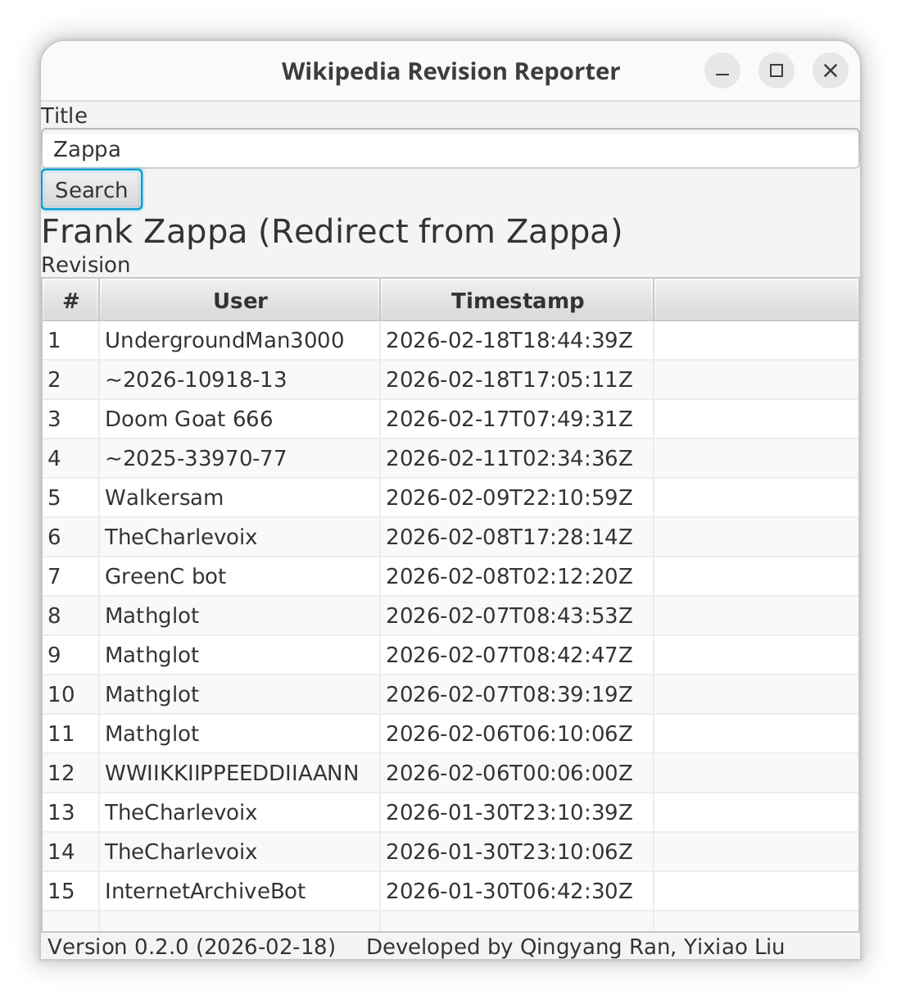

# Wikipedia Revision Reporter


## Description
Access Wikipedia change history  
The first project of CS222  

## Authors
Yixiao Liu (yixiao.liu@bsu.edu)  
Qingyang Ran (qingyang.ran@bsu.edu)  

## Build Instructions

### Prerequisites
* Language: Java
* Build system: Gradle
* JDK: Oracle OpenJDK 25.0.1

### How to Run
First, you need to clone the repository  
Make sure that Java and Gradle are configured correctly  

#### GUI Mode
```Bash
./gradlew run
```

#### Console Mode
```Bash
./gradlew run --args="--console"
```